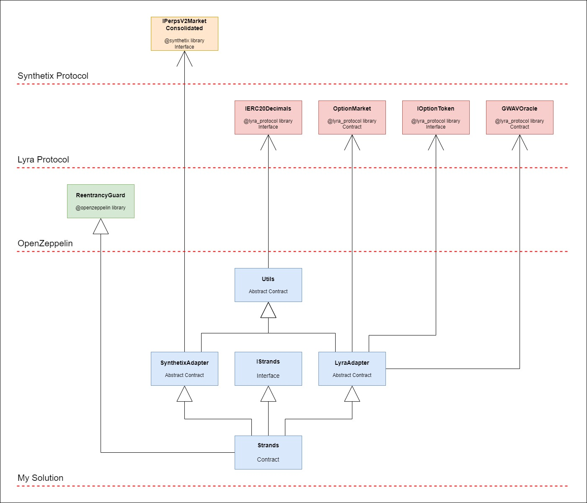
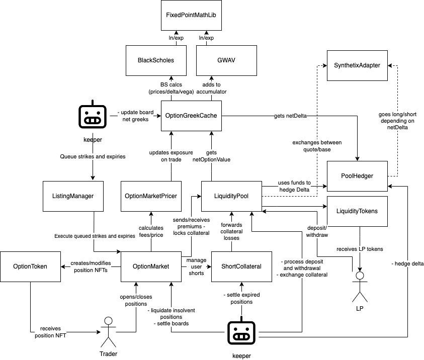

# Lyra and Synthetix Protocols Integration
##### Author: David Gimenez Gutierrez

## Objective

This repository presents an integration protocol with the Lyra and Synthetix protocols to be able to execute operations in the markets of both platforms in order to maintain delta neutral.

## Problem description

Three target tasks are defined for this implementation

* **Task 1:** Being able to open positions on the Lyra platform based on a strike id and an amount
* **Task 2:** Being able to apply hedging operations on the Synthetix platform in order to offset the operation carried out in Lyra and maintain a neutral delta
* **Task 3:** Being able to perform rebalancing operations on Synthetix to maintain delta neutrality after changes in the price of the underlying asset

* **Colorectal task:** It will be necessary to fork Optimism's main network to be able to operate locally with these two protocols and tests operations

## Solution description

### Solution architecture



As seen in the architecture diagram, the solution focuses on a contract "Strands" that centralizes the functionalities for the integration.
But the code is logically separated into three abstract components that encapsulate specific responsibilities.

#### Main componentes

* **LyraAdapter:** 
Inpcasulta all the necessary functionalities to communicate with the Lyra protocol, retrieve information and make execution requests.

* **SynthetixAdapter:** 
Inpcasulta all the necessary functionalities to communicate with the Synthetix protocol, retrieve information and make execution requests.

* **Utils:** 
Enpcasulta features necessary to interact with any contract that follows the ERC-20 standard, in order to easily operate with the underlying assets of both protocols that are establishedcoins based on this standard

Note: The functionalities of all these components were created as internal, since they are not expected to be instantiated but used by the Strands contract.

#### Interaction with external components

###### OpenZeppelin libraries

* **ReentrancyGuard:** 
I use ReentrancyGuard to prevent reentrancy attacks on Strands contracts. In addition, the "Check-Affect-Interact" pattern was used whenever possible in development to prevent attacks.

###### Lyra Protocol libraries

* **OptionMarket:** 
It is the main access door contract to the Lyra protocol, it allows interaction with the main functionalities, such as opening a position or obtaining market information and its assets. More on this component in the analysis of the Lyra protocol below.

* **IOptionToken:** 
It is the protocol interface to encapsulate the functionality of the ERC-721 standard, Non-Fungible Tokens, and expose the protocol token that is delivered to the trader after opening a position in one of the markets. In the Strands contract it is used to obtain confirmation of the operation carried out

* **GWAVOracle:** 
It is the adapter used by the protocol to expose information from its oracles. In the solution it is used, for example, to obtain the delta of a position based on its strike id

###### Synthetix Protocol libraries

* **GWAVOracle:** 
Synthetix is ​​a very complex library, since it makes extreme use of contract abstraction through the proxy pattern, but to make things easier for us, the developers developed this Interface that offers in one place all the functionality needed to operate with its protocol. Below is the complete description of the operation of the protocol.

## Analysis of integrated protocols

### Lyra Protocolo

##### Architecture


This diagram was obtained from the official Lyra documentation on their [website](https://docs.lyra.finance/developers/contracts/system-architecture)

The **Option Market** contract it's the entry point to the protocol and to the specific market you want to connect to. In the case of this solution, the contract **ETH Option Market** was used
The **Option Token** contract can be used to retrieve valuable information about our position in the system since it manages the NFTs that the system delivers on behalf of the trades made.

[ETH Option Market](https://optimistic.etherscan.io/address/0x59c671B1a1F261FB2192974B43ce1608aeFd328E#readContract)
[ETH Option Token](https://optimistic.etherscan.io/address/0xa48c5363698cef655d374675faf810137a1b2ec0)

### Synthetix Protocol

##### Architecture

[Sinthetix sETHPERP Market Diagram](<assets/Sinthetix sETHPERP Market Diagram.jpg>)

The protocol has 3 main access points

1. **PerpsV2MarketSettings:** [0x649F44CAC3276557D03223Dbf6395Af65b11c11c](https://optimistic.etherscan.io/address/0x649F44CAC3276557D03223Dbf6395Af65b11c11c#code)
2. **FuturesMarketManager:** [0xd30bdFd7e7a65fE109D5dE1D4e95F3B800FB7463](https://optimistic.etherscan.io/address/0xd30bdFd7e7a65fE109D5dE1D4e95F3B800FB7463#code)
3. **ProxyPerpsV2** [0x2B3bb4c683BFc5239B029131EEf3B1d214478d93](https://optimistic.etherscan.io/address/0x2b3bb4c683bfc5239b029131eef3b1d214478d93#code)

**ProxyPerpsV2:** It is a proxy contract that serves as a gateway to the ETH futures market used in this solution.. All interaction with the market must be done through this proxy contract.
To interact with the market in this protocol, it is enough to instantiate this proxy with the **IPerpsV2MarketConsolidated** interface that gathers all the necessary interactions.

[GitHub](https://github.com/Synthetixio/synthetix/blob/aefaae79a22a542d5f15c9271cd2f908974ba56a/contracts/interfaces/IPerpsV2MarketConsolidated.sol#L7)
[Documentation](https://docs.synthetix.io/integrations/perps-integration-guide/technical-integration)

**Note:** It is important to highlight that the identification of contracts, currencies and other functionalities is done based on the bytes32 encoding.
For example: '0x73555344' is 'sUSD' and '0x73455448' is 'sETH'

## Repository description

### Folders and files

- **Root folder**
    - **assets:** Contains the repository resource files, such as images
    - **src:** Contains the solution in smart contracts of the project. It is divided into the following sub folders
        - **contracts**
            - **abstracts**
                - **adapters**
                    - LyraAdapter.sol: Lyra protocol adapter. Encapsulates all responsibility for communication with the Lyra protocol
                    - SynthetixAdapter.sol: Synthetix protocol adapter. Encapsulates all responsibility for communication with the Synthetix protocol
                - Utils.sol: Encapsulates communication with ERC20 protocols
            - **interfaces**
                - IStrands.sol: Contains the interface of this protocol
            - Strands.sol: It is the main contract of the solution, where all the functions developed are incorporated and the main actions are carried out. 
        - **lyra_protocol**
            Contains the smart contracts from the Lyra protocol GitHub repository. The repository was incorporated because its library did not incorporate the latest changes to its protocol
        - **synthetix**
            - IBuild.Sol: Interface created to be able to compile some Synthetix libraries
            - IPerpsV2MarketConsolidated_override.sol: Interface created to be able to compile the same interface as the Synthetix library
    - **test:** Contains the test scripts of the solution

### Solution setup

1. Clone/fork the repository
2. install dependencies: 'npm install'
3. Configure optimism mainnet network fork:

    ```javascript
    //...
    networks: {
        hardhat: {
            forking: {
                url: process.env.OPTIMISM_ACCESSPOINT_URL,
                blockNumber: 108822736
            }
        }
    }
    //...
    ```
4. Compile the solution 'npx hardhat compile'
5. Run the solution tests 'npx hardhat test'

    **Note:** In this solution, the network was forked in block no: 108822736, the last one mined at the time of development, and "Alchemy" was used as a provider node to serve the connection to the Optimism blockchain.
    Change these parameters at will

**Important**
For this solution it was decided to cast the Lyra protocol repository directly and not use the **@lyrafinance/lyra-js library** due to the fact that at the time of development the library did not contain the latest updates in its interfaces

### Dependencies

    - **@nomiclabs/hardhat-ethers:** version ^2.2.3
    - **@openzeppelin/contracts:** version ^4.4.1
    - **@openzeppelin/contracts-upgradeable:** version ^4.5.1
    - **@uniswap/v3-periphery:** version ^1.4.3
    - **hardhat:** version ^2.17.2
    - **solc:** version ^0.8.21
    - **synthetix:** version ^2.93.1

    - Required compiler versions
        - 0.8.16
        - 0.7.6
        - 0.6.12
        - 0.5.16

**Note:** You may notice that the solution did not include the **@lyrafinance/lyra-js library** library, this was because at the time of development the library did not contain the latest updates in its interfaces

## Tests and coverage

#### Test scripts

* **01_lyraProtocolExplorer.test.js** 
This script walks through the Lyra protocol listing the main information of the ETH options market. Use it to explore the market and select a Board and a Strike

* **02_synthetixProtocolExplorer.test.js** 
Same for Synthetix protocol

* **03_strands.test.js** 
This is the test script itself. Perform tests on the two main functionalities developed: **buyHedgedCall** and **reHedge**

#### Test coverage

The tests in this solution are not designed to be complete, only the main functionalities are tested and not exhaustively.

## Reference links

##### Lyra Protocol

- [Website](https://www.lyra.finance/)
- [Documentation](https://docs.lyra.finance/developers/contracts)
- [GitHub](https://github.com/lyra-finance/lyra-protocol)

##### Synthetix Protocol

- [Website](https://synthetix.io/)
- [Documentation](https://docs.synthetix.io/synthetix-protocol/readme)
- [GitHub](https://github.com/Synthetixio/synthetix/tree/v2.93.1)
- [SIP-279: Perps v2 Specification](https://sips.synthetix.io/sips/sip-279/)

##### OpenZeppelin

- [Documentation](https://docs.openzeppelin.com/contracts/4.x/)
- [GitHub](https://github.com/OpenZeppelin/openzeppelin-contracts)

##### Optimism

- [Explorer](https://optimistic.etherscan.io/)

Thanks for reading!